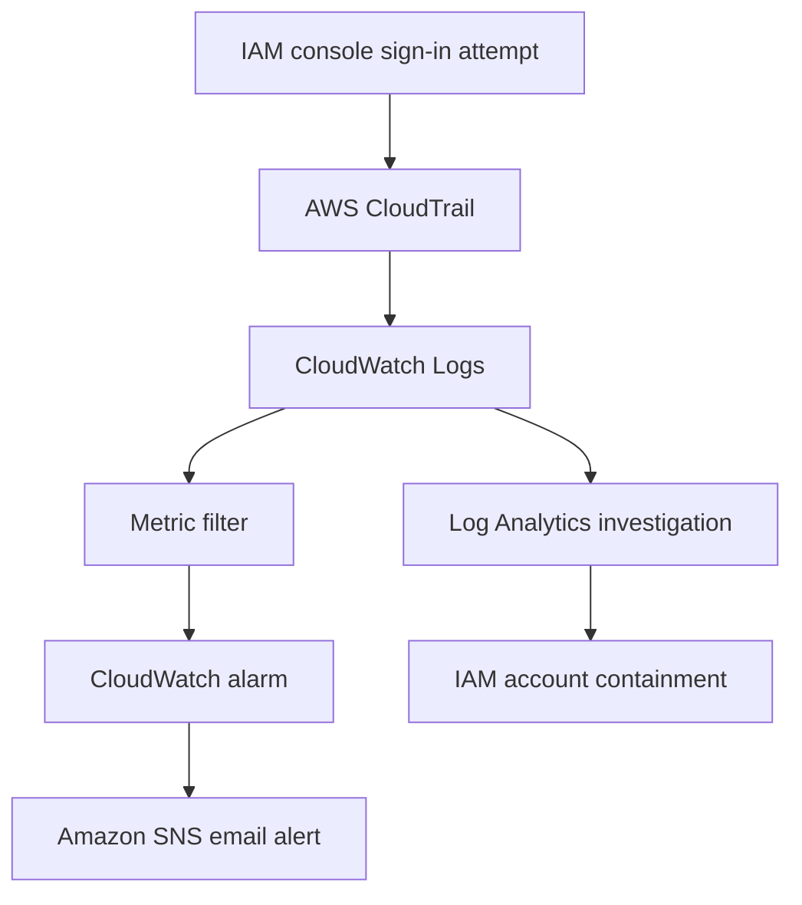
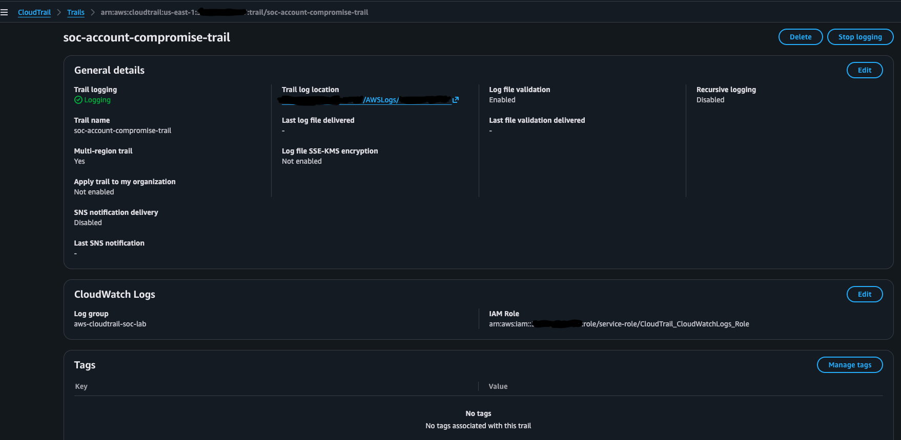
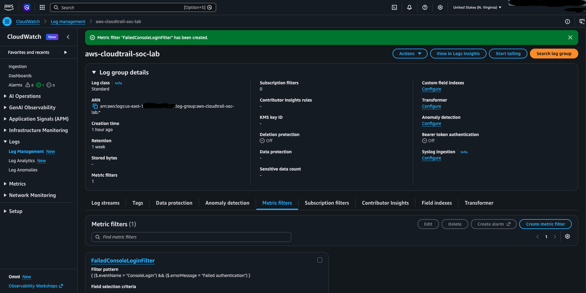
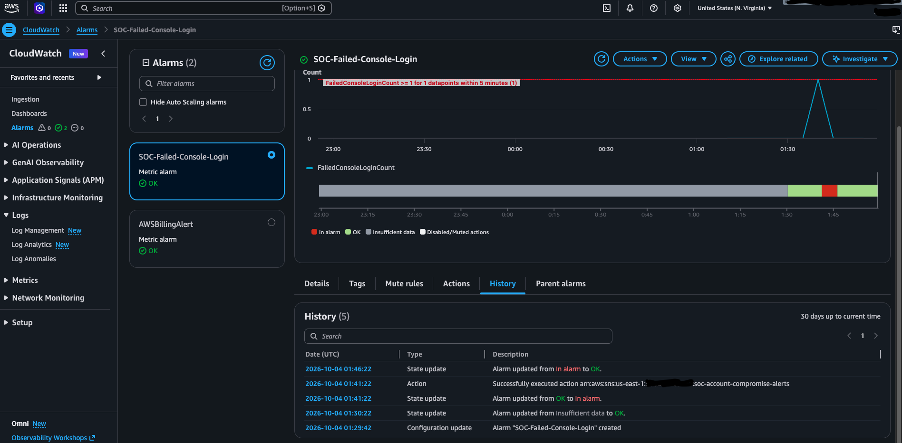
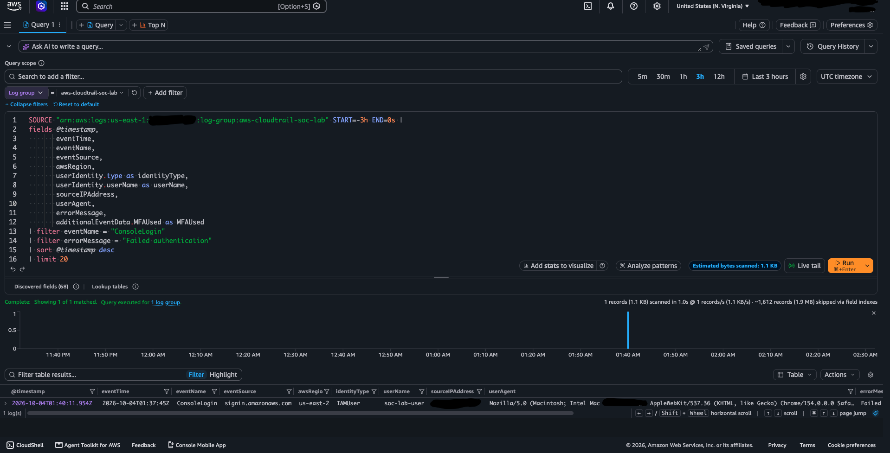
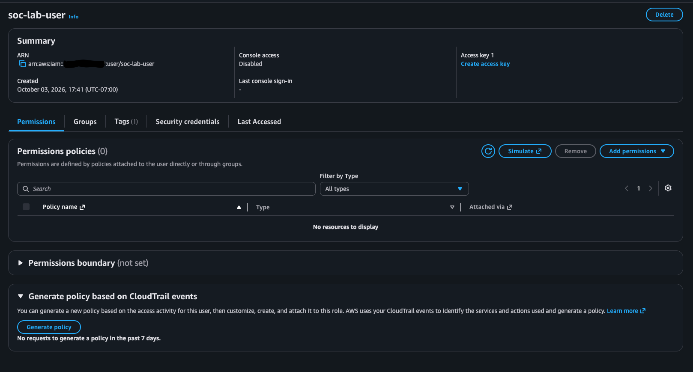

# AWS IAM Account Compromise Detection and Investigation

A hands-on AWS security monitoring project that demonstrates how to detect, alert on, investigate, and contain suspicious AWS Management Console authentication activity.

This project uses AWS CloudTrail, CloudWatch Logs, metric filters, CloudWatch alarms, Amazon SNS, and IAM to reproduce a simplified SOC incident-response workflow.

This was a controlled security lab performed in my own AWS account. No real account compromise occurred, and sensitive identifiers have been redacted.

## Project Objectives

- Create centralized logging for AWS management activity.
- Detect failed AWS Management Console authentication.
- Generate an automated email alert.
- Investigate the event using CloudWatch Log Analytics.
- Identify the affected user, source, region, authentication result, and MFA status.
- Contain the test identity by disabling console access.
- Document the incident using a professional incident report.

## Architecture



## AWS Services Used

| Service | Purpose |
|---|---|
| AWS IAM | Created and contained the temporary test identity |
| AWS CloudTrail | Recorded AWS console authentication and management events |
| Amazon S3 | Stored CloudTrail log files |
| CloudWatch Logs | Centralized CloudTrail events for analysis |
| CloudWatch metric filter | Converted matching failed-login events into a security metric |
| CloudWatch alarm | Detected when the metric reached the configured threshold |
| Amazon SNS | Delivered the alarm notification by email |
| CloudWatch Log Analytics | Investigated the authentication event |

## Lab Configuration

| Component | Configuration |
|---|---|
| AWS Region | `us-east-1` |
| CloudTrail trail | `soc-account-compromise-trail` |
| CloudWatch log group | `aws-cloudtrail-soc-lab` |
| Log retention | 7 days |
| Test IAM user | `soc-lab-user` |
| Metric filter | `FailedConsoleLoginFilter` |
| Metric namespace | `SOC-Lab` |
| Metric | `FailedConsoleLoginCount` |
| Alarm | `SOC-Failed-Console-Login` |
| SNS topic | `soc-account-compromise-alerts` |

## Detection Logic

The CloudWatch metric filter searched CloudTrail events for failed AWS Management Console authentication:

```text
{ ($.eventName = "ConsoleLogin") && ($.errorMessage = "Failed authentication") }
```

The filter generated a metric value of `1` for every matching event. The alarm entered the `ALARM` state when at least one failed login was detected during a five-minute period.

## Project Workflow

### 1. Logging foundation

I created a multi-Region CloudTrail trail and configured it to record management events. Events were sent to an S3 bucket and the `aws-cloudtrail-soc-lab` CloudWatch log group.

The CloudWatch log group was configured with a seven-day retention period to control storage costs.



### 2. Logging validation

I used CloudWatch Log Analytics to verify that CloudTrail management events were being ingested correctly. A `PutRetentionPolicy` event confirmed that the logging pipeline was functioning.

[View logging-validation evidence](screenshots/06-cloudwatch-cloudtrail-event.png)

### 3. Test identity

I created the temporary IAM user `soc-lab-user` with console access but no policies, groups, permissions boundary, or access keys. This limited the potential impact of the controlled simulation.

[View test-user evidence](screenshots/07-lab-iam-user-no-permissions.png)

### 4. Alerting configuration

I created an SNS email subscription, a failed-login metric filter, and a CloudWatch alarm. The alarm was configured to notify the SNS topic when one failed console login occurred.



### 5. Controlled simulation

A single incorrect password was entered for `soc-lab-user` in a separate private browser session.

[View simulated failed-login evidence](screenshots/11-simulated-failed-login.png)

### 6. Detection and notification

The failed login increased `FailedConsoleLoginCount` to `1`. The alarm changed from `OK` to `In alarm`, executed the SNS notification action, and later returned to `OK`.



The subscribed email account also received the CloudWatch alarm notification.

[View email-alert evidence](screenshots/14-sns-alarm-email.png)

### 7. Investigation

I queried the CloudTrail events in CloudWatch Log Analytics and identified the following:

| Field | Finding |
|---|---|
| Event name | `ConsoleLogin` |
| Event source | `signin.amazonaws.com` |
| Identity type | `IAMUser` |
| Username | `soc-lab-user` |
| Result | `Failed authentication` |
| MFA used | `No` |
| Event region | `us-east-2` |
| Source IP | Redacted |

The `us-east-2` event region was associated with AWS global sign-in processing. The monitoring resources remained in `us-east-1`.



The authentication failed, so no console session was established and no unauthorized access occurred.

### 8. Containment

After completing the investigation, I disabled console access for `soc-lab-user`. The account continued to have zero permissions and no access keys.



## Incident Timeline

| Time (UTC) | Event |
|---|---|
| 01:37:45 | Controlled failed authentication occurred |
| 01:40:11 | Event became available in CloudWatch Logs |
| 01:41:22 | Alarm entered the `ALARM` state |
| 01:41:22 | SNS notification action executed |
| 01:46:22 | Alarm returned to `OK` |
| After investigation | Console access for the test user was disabled |

The observed event-to-alert time was approximately three minutes and thirty-seven seconds.

## Investigation Query

```text
fields @timestamp,
       eventTime,
       eventName,
       eventSource,
       awsRegion,
       userIdentity.type as identityType,
       userIdentity.userName as userName,
       sourceIPAddress,
       userAgent,
       errorMessage,
       additionalEventData.MFAUsed as MFAUsed
| filter eventName = "ConsoleLogin"
| filter errorMessage = "Failed authentication"
| sort @timestamp desc
| limit 20
```

## Security Findings

- The failed authentication was successfully recorded by CloudTrail.
- The metric filter matched the expected event.
- The alarm and email notification functioned as designed.
- The test identity had no permissions or access keys.
- No successful unauthorized login occurred.
- Console access was disabled after investigation.
- Account IDs, email addresses, sign-in aliases, bucket identifiers, and source IP details were redacted from public evidence.

## Recommendations

- Require MFA for active IAM users.
- Apply least-privilege permissions.
- Avoid using the root user for daily administration.
- Monitor both failed and successful console authentication.
- Investigate unfamiliar source IP addresses and user agents.
- Disable unused IAM identities.
- Use short log-retention periods for temporary labs.
- Review AWS billing and remove unused lab resources.

## Skills Demonstrated

- AWS security monitoring
- IAM security and least privilege
- CloudTrail analysis
- CloudWatch Logs and Log Analytics
- Detection engineering
- Metric filters and alarms
- SNS alerting
- Incident triage and investigation
- Incident containment
- Security documentation
- Cost-conscious cloud-lab management

## Project Evidence

All redacted project evidence is available in the [`screenshots`](screenshots/) directory.

A detailed incident record is available in [`incident-report.md`](incident-report.md).

## Cleanup and Cost Control

After completing the investigation and preserving the project evidence, I removed the temporary AWS resources to prevent unnecessary charges. This included the test IAM user, CloudWatch alarm, metric filter, log group, CloudTrail trail, S3 bucket, SNS topic, CloudTrail IAM role, and its customer-managed policy.

This cleanup demonstrated responsible cloud-resource lifecycle management and cost awareness.

## Lessons Learned

This project showed how AWS services can be connected to form an end-to-end security monitoring workflow. It also demonstrated that detection is only one part of incident response. An analyst must validate the alert, examine the identity and source information, determine whether access succeeded, contain the affected identity, and document the outcome clearly.

## References

- [AWS CloudTrail documentation](https://docs.aws.amazon.com/cloudtrail/)
- [AWS Management Console sign-in events](https://docs.aws.amazon.com/awscloudtrail/latest/userguide/cloudtrail-event-reference-aws-console-sign-in-events.html)
- [Monitoring CloudTrail logs with CloudWatch Logs](https://docs.aws.amazon.com/awscloudtrail/latest/userguide/monitor-cloudtrail-log-files-with-cloudwatch-logs.html)
- [Amazon CloudWatch Logs metric filters](https://docs.aws.amazon.com/AmazonCloudWatch/latest/logs/MonitoringLogData.html)
- [Amazon SNS documentation](https://docs.aws.amazon.com/sns/)
